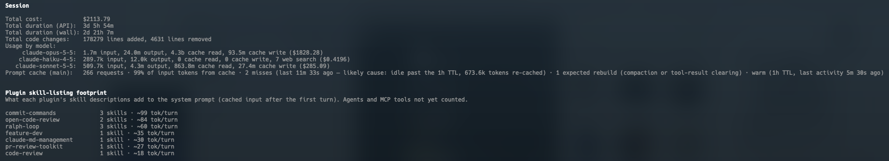

# Sunday Clays

**Every Sunday, 10 to noon, a group of shooters meets at Tri-County Gun Club in Sherwood, Oregon, to shoot 50
targets. For years the scores lived in two Excel workbooks. Now they live here:
[sundayclays.claysmasher.com](https://sundayclays.claysmasher.com).**

Sunday Clays turns six years of scoresheets into shooter profiles, personal bests, station difficulty, weather
effects, leaderboards that celebrate improvement, a trophy case, and hundreds of little "did you know" insights.
Each insight links to the chart that proves it. Upload the new workbook each week and everything updates.

It went from an empty repo to a live, self-hosted site in **four days**: September 27 to 30, 2026, 160+ pull
requests. We built it with [Claude Code](https://claude.com/claude-code) and a homelab full of local AI.

> The shooters in this repository have **invented names**. The scores, dates and weather are real, but every
> name in the test data, docs and examples was replaced before publishing. The live site uses the real names.

---

## What it does

- **Shooter profiles:** personal bests (overall, by season, weather and gauge), form and trends, a rating curve
  with its uncertainty band, a learning curve against the club, an attendance calendar, and a lifetime "odometer"
  (clays thrown, clays broken, streaks).
- **Stations:** hit rates per station with honest confidence intervals, how difficulty changes when the course
  is reset, which stations separate good days from great ones, and "where you lose targets".
- **Weather:** every Sunday's 10:00 to 12:00 conditions from Open-Meteo's historical archive (temperature, wind,
  gusts, rain, cloud). Rain against dry, cold against hot, wind by station, and each shooter's sensitivity,
  shrunk toward the club average so a few rainy Sundays can't tell a tall tale.
- **Skill model:** a small Kalman-filter rating that separates a shooter's skill from how hard the day was.
  Every Sunday gets a difficulty score, and every round gets an expected score. It powers "played above
  themselves", next-Sunday predictions and the improvement boards.
- **Leaderboards, the good-vibes way:** there is no "best shooter of all time" ranking. The boards call out who's
  improving, who shows up, who set a personal best, and a season points race you can replay as a bar-chart race.
- **Trophy Case:** 31 trophies, from the tiered "Clays Broken" family (bronze through diamond) to Mudder (40+ in
  the rain) and Welcome Back. Tiered trophies show a progress bar toward the next tier.
- **Insights:** about 70 kinds of precomputed facts ("first 45+ in over a year", "the club shot 2 targets better
  in the dry"). Each is checked against its own chart before it is shown, and recomputed only when a new upload
  lands.
- **Explorer:** pick any metric, group by anything, filter, and get a chart, a table and a CSV. Every chart has
  a plain-English "what this shows" explainer, a table view, CSV export and fullscreen.
- **Phone and desktop:** both are first-class, and every page is tested at both sizes.

## Weekly uploads, safely

The club keeps its spreadsheets, and the site follows them.

- Upload the latest scores workbook or station workbook. You get a preview of exactly what will change: new
  Sundays, changed rows, new shooters, possible duplicate names, station totals that don't match.
- Nothing changes until you commit.
- Every upload is kept. Any upload can be rolled back, and the live data is always **rebuilt** from the uploads,
  never patched.
- Messy names get fixed with durable rules, not by editing data: trailing spaces, missing commas, typos,
  first-name-only guests. A merge or rename survives every future upload.

## Local AI in the loop

### Reading six months of paper scoresheets

The spreadsheets only have totals. Station-by-station detail existed only on the scanned scoresheet PDFs in
the club's weekly update emails. So we built [`tools/scoresheets`](tools/scoresheets/README.md), a
vision-model pipeline that reads them:

1. **Cut each scoresheet** into its six shooter blocks and read the course layout, including pictured courses
   and lettered stations like 7A.
2. **Read each block with a local vision model** served by Unsloth Studio. We started with **Qwen3-VL-30B-A3B**
   and settled on **Gemma 4 26B**, both running on our own hardware.
3. **Add a fast pass:** Claude (Opus) reads whole pages four at a time, and Gemma reads the same pages again
   locally as a second opinion.
4. **Trust the spreadsheet.** A shooter's station totals must add up **exactly** to the official spreadsheet
   score, or the reading doesn't count. Anything doubtful lands on a review page, where a human decides.
5. **Import the verified workbook** through the same upload screen as everything else.

That's 45 Sundays of station detail (October 2025 to September 2026) recovered from paper.

### Trophy art from a homelab GPU

Every trophy medallion, and every metal tier of it, was generated on **imagen**, our self-hosted image
generation service, using the Z-Image Turbo model. [`tools/trophy_art`](tools/trophy_art) submits one prompt per
trophy and metal with several seeds, builds a contact sheet, and a human picks the favourites. The picks are cut
into round medallions and committed as small WebP files. The site never calls an AI at runtime; the art is
static.

## How it was built

Claude Code wrote the code as a team of agents, with a human setting direction and making every judgment call:

- **Spec first.** An afternoon of brainstorming produced a design spec and a master plan, which was split into
  13 sub-plans with every task written test-first.
- **Subagent-driven development.** Each task went to a fresh implementer agent in its own git worktree and
  branch. Every task was then reviewed by a separate, more capable reviewer model for spec compliance and code
  quality. Fix rounds went back and forth until the reviewer approved, and a whole-plan review closed each plan.
- **Parallel lanes.** Up to four UI lanes and the backend work ran at once on disjoint files, merging through
  GitHub auto-merge as CI went green.
- **Owner rules as code.** Some decisions became hard constraints that every agent and reviewer checks:
  - Improvement over ranking.
  - Positive-only insights about named shooters.
  - Neutral pronouns in all app copy.
  - The spreadsheet score is authoritative.
  - One date filter per page.
- **CI as the gate.** One required check, `ci-ok`, passes only when everything below passes:
  - Ruff and strict mypy.
  - ESLint and TypeScript.
  - About 2,700 backend and 2,100 frontend tests, with coverage held around 99% on both sides.
  - Bundle-size budgets.
  - Multi-arch image builds.
  - A Swarm config policy check.
  - Playwright end-to-end tests at phone and desktop sizes.
  - A backup-restore check.

### What it cost



At pay-as-you-go API prices the whole build would have come to about **$2,100**:
- 178,000 lines added.
- About 2 days 21 hours of wall-clock time, and 3 days 5 hours of API time, because agents ran in parallel.
- Mostly Opus for planning and reviews, and Sonnet for implementation.

It ran on a Claude subscription instead, so the real cost was about **$50**: roughly one week's usage allowance.
The local models (Gemma, Qwen, Z-Image Turbo) ran on hardware we already had.

## Stack

| | |
|---|---|
| Backend | Python 3.13, FastAPI, SQLAlchemy 2, Alembic, Postgres 17, pandas, NumPy, SciPy |
| Frontend | React 19, Vite, TypeScript, TanStack Query, React Router, Tailwind v4, Apache ECharts |
| Data | Open-Meteo archive and forecast; the club's Excel workbooks (openpyxl) |
| Tests | pytest with real Postgres (testcontainers), Hypothesis, Vitest, Testing Library, MSW, Playwright |
| Hosting | Docker Swarm on a mixed Raspberry Pi and x86 homelab; Caddy behind Traefik; Cloudflare Tunnel |

## Running it at home

- **Images:** multi-arch (amd64 and arm64) images are published from green `main` commits.
- **Deploys:** a small pull-based deployer on a Swarm manager watches `main`. It mirrors each release into the
  local registry, then rolls the services one at a time with health checks, and rolls back on any failure.
  Merge a PR and the site updates itself a few minutes later.
- **Backups:** the database is dumped and verified nightly, then shipped off-site with the rest of the homelab.

See [`deploy/README.md`](deploy/README.md) for the full runbook.

## Development

```sh
scripts/dev-secrets.sh                 # local secrets (random passwords, printed once)
docker compose up -d --build --wait    # http://localhost:8080
```

- Backend: `cd backend && uv run pytest`.
- Frontend: `cd frontend && pnpm test`.
- See [`CONTRIBUTING.md`](CONTRIBUTING.md) for the workflow.

---

Built for the Sunday Clays crew, with thanks to everyone who kept score all those years. Feedback and ideas
welcome.
